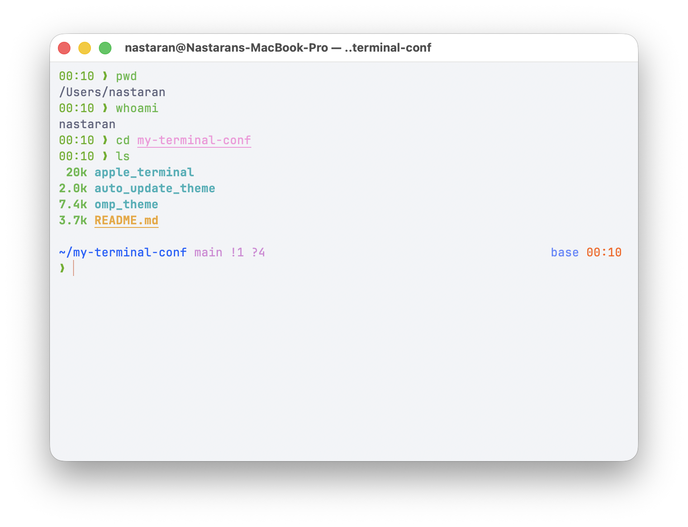
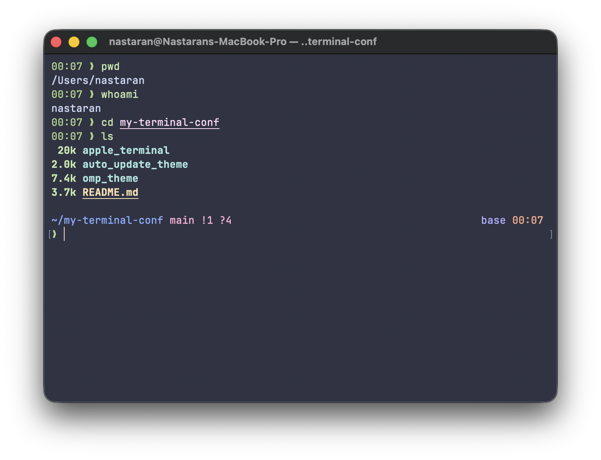

# 🍎 Terminal Configuration Setup

This repository contains my personal **Apple Terminal configuration**, including themes, fonts, plugins, and automation scripts for switching between dark and light modes.

---

## 🖼️ Preview

| Light Mode (Catppuccin Latte) | Dark Mode (Catppuccin Frappe) |
|-------------------------------|-------------------------------|
|  |  |

## 📦 Installation Guide

### 1. Install Homebrew

```bash
/bin/bash -c "$(curl -fsSL https://raw.githubusercontent.com/Homebrew/install/HEAD/install.sh)"
echo 'eval "$(/opt/homebrew/bin/brew shellenv)"' >> ~/.zprofile
eval "$(/opt/homebrew/bin/brew shellenv)"
```

---

### 2. Customize Apple Terminal

Install **JetBrains Mono Nerd Font**:

```bash
brew install --cask font-jetbrains-mono-nerd-font
```

Then import the following themes in **Terminal → Settings → Profiles → ⚙️ → Import...**:

- `apple_terminal/catppuccin-latte.terminal`
- `apple_terminal/catppuccin-frappe.terminal`

> **Note:** Make sure the font is set to **JetBrainsMono NFM 13** in Terminal preferences.

---

### 3. Install Oh My Zsh

```bash
sh -c "$(curl -fsSL https://raw.githubusercontent.com/ohmyzsh/ohmyzsh/master/tools/install.sh)"
```

---

### 4. Install Plugins

```bash
brew install git

# Zsh Autosuggestions
git clone https://github.com/zsh-users/zsh-autosuggestions ${ZSH_CUSTOM:-~/.oh-my-zsh/custom}/plugins/zsh-autosuggestions

# Zsh Syntax Highlighting
git clone https://github.com/zsh-users/zsh-syntax-highlighting.git ${ZSH_CUSTOM:-~/.oh-my-zsh/custom}/plugins/zsh-syntax-highlighting

# Fast Syntax Highlighting (optional alternative)
git clone https://github.com/zdharma-continuum/fast-syntax-highlighting.git ${ZSH_CUSTOM:-~/.oh-my-zsh/custom}/plugins/fast-syntax-highlighting
```

---

### 5. Automatically Apply Dark/Light Theme

This script automatically switches your Terminal theme based on macOS system appearance.

```bash
mkdir -p ~/Library/Scripts
cp auto_update_theme/terminal-theme-watcher.swift ~/Library/Scripts/
chmod +x ~/Library/Scripts/terminal-theme-watcher.swift

cp auto_update_theme/com.user.terminaltheme.swift.plist ~/Library/LaunchAgents/

launchctl load ~/Library/LaunchAgents/com.user.terminaltheme.swift.plist
```

---

### 6. Install Oh My Posh

```bash
brew install jandedobbeleer/oh-my-posh/oh-my-posh

mkdir -p ~/.config/ohmyposh/
cp omp_theme/* ~/.config/ohmyposh/
```

---

### 7. Install Aliases and Tools

Install **eza**, a modern replacement for `ls`:

```bash
brew install eza
```

---

### 8. Update `.zshrc`

> ⚠️ **Important:** Do **not** overwrite your existing `~/.zshrc` without checking it first.  
> Review the provided configuration and merge it carefully.

After editing, reload your terminal:

```bash
exec zsh
```

---

## 🧩 Folder Structure

```
.
├── README.md
├── apple_terminal
│   ├── catppuccin-frappe.terminal
│   └── catppuccin-latte.terminal
├── assets
│   ├── frappe_preview.png
│   └── latte_preview.png
├── auto_update_theme
│   ├── com.user.terminaltheme.swift.plist
│   └── terminal-theme-watcher.swift
└── omp_theme
    ├── frappe.omp.json
    └── latte.omp.json
```

---

## 🧠 Notes

- Tested on **macOS 14 (Sonoma)**
- Themes based on **Catppuccin Latte** ☀️ and **Frappe** 🌙
- Designed for **Apple Terminal**, but can be adapted for **iTerm2**
- Compatible with **Oh My Zsh** and **Oh My Posh**

**Enjoy your beautifully themed Terminal! 🚀**
